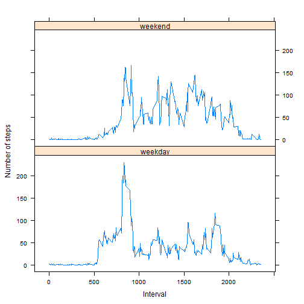

## Loading and preprocessing the data

```r
#### Unzip the dataset zip file
unzip("./activity.zip", overwrite=TRUE, exdir=getwd())
#### Read in the dataset csv file
all_data <- read.csv("activity.csv",
                     header=TRUE,
                     colClasses=c("numeric", "character", "numeric"))
#### Convert date column to date type
act_data <- data.frame(steps=all_data$steps,
                       date=strptime(all_data$date, "%Y-%m-%d"),
                       interval=all_data$interval)
```


## What is mean total number of steps taken per day?

```r
#### Aggregate total steps by date, ignoring rows where a value is NA
steps_data <- aggregate(steps~date, act_data, sum, na.action=na.omit)
#### Draw the histogram
hist(steps_data$steps, col="azure", main="Total steps per day", 
     xlab="Total number of steps in a day", border="blue")
```

 

```r
#### Print the mean steps per day
p <- paste("The average total number of steps per day are ", mean(steps_data$steps))
print(p)
```

```
## [1] "The average total number of steps per day are  10766.1886792453"
```

```r
#### Print the median steps per day
p <- paste("The median total number of steps per day are ", median(steps_data$steps))
print(p)
```

```
## [1] "The median total number of steps per day are  10765"
```


## What is the average daily activity pattern?

```r
#### Aggregate average steps by 5-min time interval across days, ignoring NA rows
steps_data <- aggregate(steps~interval, act_data, mean, na.action=na.omit)
#### Plot a line graph for average steps for every 5-min interval
plot(steps_data$interval, steps_data$steps, col="black", type="l",
     main="Average number of steps per 5 min interval across all days",
     xlab="Interval", ylab="Average steps taken")
```

 

```r
#### Find the 5-min interval which has the maximum avergae steps taken
p <- paste("The 5-min interval with the highest average number of steps is ",
           steps_data[which(steps_data$steps == max(steps_data$steps)),1])
print(p)
```

```
## [1] "The 5-min interval with the highest average number of steps is  835"
```

```r
p <- paste("The highest average number of steps in it are ",
           steps_data[which(steps_data$steps == max(steps_data$steps)),2])
print(p)
```

```
## [1] "The highest average number of steps in it are  206.169811320755"
```


## Imputing missing values

```r
#### Calculate and output the number of rows with missing values (NAs)
num_miss_rows <- nrow(all_data) - nrow(na.omit(all_data))
p <- paste("The total number of rows with missing values is ", num_miss_rows)
print(p)
```

```
## [1] "The total number of rows with missing values is  2304"
```

```r
#### Aggregate average steps by interval, ignoring rows where a value is NA
#### Cannot be done using average for a date as for some dates all values are NA
steps_data <- aggregate(steps~interval, act_data, mean, na.action=na.omit)
#### Populate mean by interval if value missing in any row in original dataset
for (i in 1:nrow(act_data)) {
      if (is.na(act_data$steps[i])) {
            act_data$steps[i] <- steps_data$steps[which(steps_data$interval 
                                                  == act_data$interval[i])]
      }
}
#### Prepare dataset with total steps per date
steps_data <- aggregate(steps~date, act_data, sum)
#### Draw the histogram
hist(steps_data$steps, col="azure", main="Total steps per day", 
     xlab="Total number of steps in a day", border="blue")
```

 

```r
#### Print the mean steps per day
p <- paste("The average total number of steps per day are ", mean(steps_data$steps))
print(p)
```

```
## [1] "The average total number of steps per day are  10766.1886792453"
```

```r
#### Print the median steps per day
p <- paste("The median total number of steps per day are ", median(steps_data$steps))
print(p)
```

```
## [1] "The median total number of steps per day are  10766.1886792453"
```
***After imputing missing data with mean for that interval, there is no change in the mean, and only a slight change in median values***

## Are there differences in activity patterns between weekdays and weekends?

```r
#### Add a new factor column with weekday populated based on the date
act_data$weekday <- "weekday"
for (i in 1:nrow(act_data)) {
      if ((weekdays(act_data$date[i])=="Saturday") || (weekdays(act_data$date[i])=="Sunday"))
      {
            act_data$weekday[i] <- "weekend"
      }
}
act_data$weekday <- as.factor(act_data$weekday)
#### Prepare dataset with average  steps per interval by weekday or weekend
steps_data <- aggregate(steps~interval+weekday, data=act_data, mean)
#### Plot the data using lattice system
library(lattice)
xyplot(steps ~ interval | weekday, data=steps_data, layout=c(1,2), type="l",
       xlab="Interval", ylab="Number of steps")
```

 

## Clean up the environment at the end of the run

```r
rm(all_data, act_data, steps_data)
system("rm", args="-f activity.csv")
```

```
## Error in system("rm", args = "-f activity.csv"): unused argument (args = "-f activity.csv")
```
